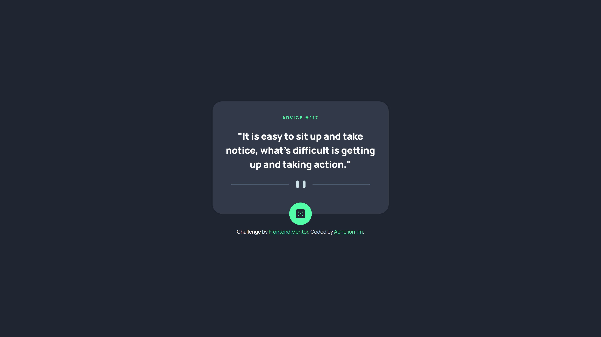

# Frontend Mentor - Advice generator app solution

This is a solution to the [Advice generator app challenge on Frontend Mentor](https://www.frontendmentor.io/challenges/advice-generator-app-QdUG-13db). Frontend Mentor challenges help you improve your coding skills by building realistic projects.

## Table of contents

- [Overview](#overview)
  - [The challenge](#the-challenge)
  - [Screenshot](#screenshot)
  - [Links](#links)
- [My process](#my-process)
  - [Built with](#built-with)
  - [What I learned](#what-i-learned)
  - [Continued development](#continued-development)
  - [Useful resources](#useful-resources)
- [Author](#author)

## Overview

### The challenge

Users should be able to:

- View the optimal layout for the app depending on their device's screen size
- See hover states for all interactive elements on the page
- Generate a new piece of advice by clicking the dice icon

### Screenshot

### Links

- Solution URL: [Github repo](https://github.com/Aphelion-im/Advice-generator-app)
- Live Site URL: [Advice generator app](https://aphelion-advice-generator-app.netlify.app)

## My process

### Built with

- Semantic HTML5 markup
- Sass
- Flexbox
- CSS Grid
- Mobile-first workflow
- ViteJS

### What I learned
- That Grid is easier than I thought. 
- Found a nice CSS glow generator. See the Useful resources section.
- The Advice slip API

### Continued development
Perhaps, some day I will turn it into a React or Vue project.

### Useful resources

- [CSS box shadow generator](https://cssgenerator.org/box-shadow-css-generator.html) - Handy tool to generate CSS shadows.
- [CSS glow generator](https://cssbud.com/css-generator/css-glow-generator/) - Handy tool to generate CSS glows.
- [Advice Slip API](https://validator.w3.org/nu/#textarea) - HTML & CSS validator to find errors and validate your code.
- [Axios](https://cdnjs.com/libraries/axios) - To use Axios without installing it using NPM and get extra dependencies.

## Author

- Frontend Mentor - [@Aphelion-im](https://www.frontendmentor.io/profile/Aphelion-im)

